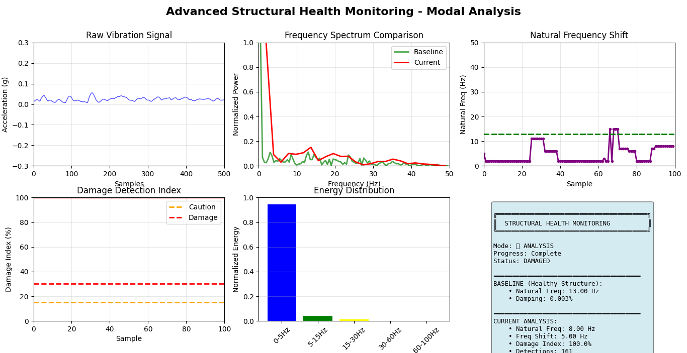
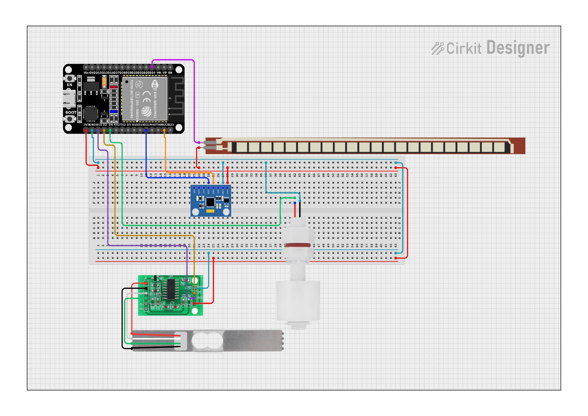

# 🚧 Advanced Structural Health Monitoring System using Modal Analysis

> An IoT-based Structural Health Monitoring (SHM) system that uses vibration analysis, modal analysis, and signal processing to detect structural damage in bridges and civil infrastructure.



---

## 📖 Overview

Structural Health Monitoring (SHM) is an essential technique for ensuring the safety and reliability of bridges and other civil structures.

This project uses an **ESP32** with an **MPU6050 accelerometer** to collect vibration data from a structure. The collected data is analyzed in **Python** using **Fast Fourier Transform (FFT)** and modal analysis techniques to estimate:

- Natural Frequency
- Frequency Shift
- Energy Distribution
- Damage Index

The system compares the current structural response with a healthy baseline to detect possible structural damage.

---

## ✨ Features

- 📡 Real-time vibration monitoring
- 📈 FFT-based frequency spectrum analysis
- 🎯 Natural frequency estimation
- ⚡ Damage Index calculation
- 📊 Energy distribution across frequency bands
- 📝 Automatic CSV logging
- 📉 Live visualization using Matplotlib
- 🔍 Modal analysis based damage detection
- 🚨 Healthy / Caution / Damaged status indication

---

## 🛠 Hardware Used

- ESP32 Development Board
- MPU6050 Accelerometer & Gyroscope
- USB Cable
- Bridge Prototype / Test Structure

---

## 💻 Software Used

- Python 3.x
- Arduino IDE
- NumPy
- SciPy
- Matplotlib
- PySerial

---

## 📂 Project Structure

```
├── bridge_monitor.py
├── AE_plot.py
├── Advanced_Structural_Health_Monitoring.png
├── shm_analysis_xxxxx.csv
├── README.md
```

---

## ⚙️ Working Principle

### 1. Data Acquisition

ESP32 continuously reads vibration data from the MPU6050 sensor and transmits it through the serial port.

↓

### 2. Signal Processing

Python receives the data and performs:

- Windowing (Hamming Window)
- Fast Fourier Transform (FFT)
- Natural Frequency Estimation

↓

### 3. Feature Extraction

The following modal parameters are calculated:

- Natural Frequency
- Damping Estimation
- Frequency Shift
- Energy Distribution

↓

### 4. Damage Detection

The extracted features are compared with baseline values to compute a **Damage Index**.

↓

### 5. Visualization

Real-time graphs display:

- Raw vibration signal
- Frequency spectrum
- Natural frequency trend
- Damage index
- Energy distribution
- Overall structural health status

---

# 📊 Dashboard

The monitoring dashboard provides six real-time plots:

- Raw Vibration Signal
- Frequency Spectrum Comparison
- Natural Frequency Shift
- Damage Detection Index
- Energy Distribution
- Structural Health Summary

---

## 📈 Damage Detection Logic

The system detects damage using modal parameters.

### Frequency Shift

Damage generally causes:

- Reduction in stiffness
- Reduction in natural frequency

The greater the frequency shift, the higher the damage probability.

### Energy Distribution

The FFT spectrum is divided into frequency bands:

- 0–5 Hz
- 5–15 Hz
- 15–30 Hz
- 30–60 Hz
- 60–100 Hz

Energy redistribution indicates structural changes.

### Damage Index

The final Damage Index is calculated using a weighted combination of:

- Frequency Shift
- Energy Difference
- Damping Change

The result is normalized to:

```
0%  → Healthy

15% → Caution

30% → Damaged

100% → Severe Damage
```

---

## ▶️ Running the Project

### 1. Clone Repository

```bash
git clone https://github.com/yourusername/Advanced-Structural-Health-Monitoring.git

cd Advanced-Structural-Health-Monitoring
```

---

### 2. Install Dependencies

```bash
pip install numpy scipy matplotlib pyserial
```

---

### 3. Upload ESP32 Firmware

Upload the Arduino code to ESP32.

Set the correct serial port.

Example:

```python
SERIAL_PORT = "COM3"
```

or

Linux

```python
SERIAL_PORT="/dev/ttyUSB0"
```

---

### 4. Run

```bash
python bridge_monitor.py
```

---

## 📊 Example Output

The system provides:

- Baseline Natural Frequency
- Current Natural Frequency
- Frequency Shift
- Damage Index
- Energy Distribution
- Structural Health Status

Example:

```
Baseline Natural Frequency : 13 Hz

Current Natural Frequency : 8 Hz

Frequency Shift : 5 Hz

Damage Index : 100 %

Status : DAMAGED
```

---

## 📁 Output Files

The program automatically generates

```
bridge_data/

    shm_analysis_YYYYMMDD_HHMMSS.csv
```

The CSV stores

- Timestamp
- RMS
- Natural Frequency
- Frequency Shift
- Damage Index
- Health Status
- Analysis Mode

---

## 📚 Applications

- Bridge Health Monitoring
- Building Monitoring
- Railway Bridge Inspection
- Wind Turbine Monitoring
- Industrial Machinery Monitoring
- Structural Safety Assessment
- Predictive Maintenance
- Research in Modal Analysis

---

## 🚀 Future Improvements

- Wireless IoT Monitoring
- Cloud Dashboard
- Machine Learning Based Damage Classification
- Crack Detection using Computer Vision
- MQTT Communication
- Mobile Application
- Multi-Sensor Fusion
- Real-time Alert System

---

## 📸 Screenshot




📷 **Complete output images are available here:**

👉 **[Screenshots Folder](./Screenshots/)**


---

## 👨‍💻 Author

**B. Rakeshkumar**

Electronics and Communication Engineering

Shree Devi Institute of Technology

---

## 📜 License

This project is released under the MIT License.
